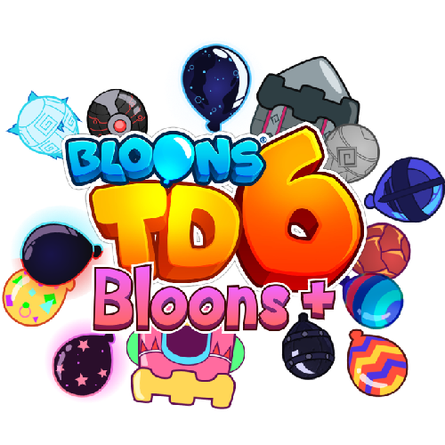

<h1 align="center">XStablesMod</h1>

XStables's Mod, aka Bloons+, aims to expand your BTD6 experience. Adds in content from BTDX, as well as some all-original content!

Features:
- 30+ New Bloon Types
- Several New Gamemodes
- Roundset Overrides for All Regrow/All Camo
- A WIP new custom override roundset to spice up gameplay a bit (Note: As of beta, this only goes to Round 40, after which normal rounds are used.)

This mod is in BETA. Not all features for this mod are finalized or have been implemented as of yet.

Planned Features:
- More Gamemodes
- More Override Roundsets
- Some More Bloons

Mod by XStables
Special Thanks: Ninja Kiwi (BTD6), Ramaf Party (BTDX), Project Spark (Original Bloons)
Additional credits to the other owners of sources not made by XStables

NOTE: This mod could/may work on updates 36 and 37, however, this mod was made with update 38+.

WARNING: The green download button does not work properly. Click the below link to get the mod.
https://github.com/XStables/BloonsPlus/releases/tag/beta-1

